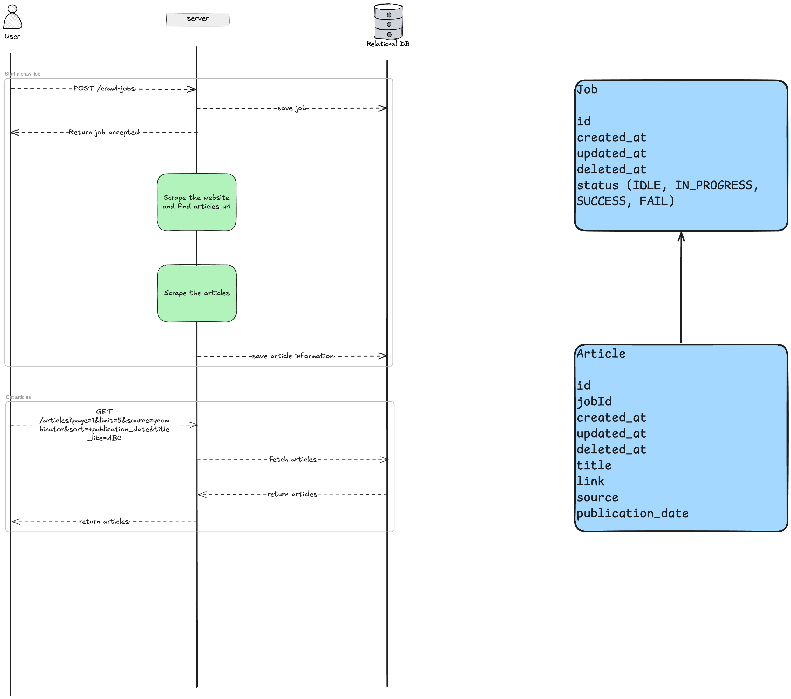

# Scraper

## How to start

### Pre-requisites

- node
- npm
- docker
- docker-compose

### Install dependencies

```bash
npm install
```

### Copy the .env.example file

```bash
cp .env.example .env
```

The .env.example file contains the default values for the environment variables. You can change them if you want.

### Start MySQL

```bash
docker-compose up -d
```

### Start the server

```bash
npm start
```

## Schema




## Problèmes de l'implémentation actuelle

1. Pas de système pour être "poli" envers les serveurs cibles. Il sera préférable de rajouter une queue qu'on dépile à un rythme raisonnable pour ne pas surcharger les serveurs cibles. Si un grand nombre de requête de scraping est envoyé en même temps, les serveurs cibles peuvent bloquer l'adresse IP de l'application car ils peuvent penser qu'il s'agit d'une attaque.

2. Il n'y a pas de système de retry. Si une requête échoue, elle est perdue. Le système de queue pourrait aussi permettre de réessayer les requêtes qui ont échoué.

3. A chaque fois qu'on lance un scraping, on récupère tous les articles et on les stocke en base de données sans se demander si on a déjà récupéré ces articles. Si on continue ainsi, on va vite faire grossir la base de données inutilement. Il faudrait rajouter un système de vérification pour ne pas stocker les articles déjà récupérés.

4. Lors de la récupération des articles, on fait toujours une requête à la base données. Cela peut être très coûteux en temps si on a beaucoup d'articles. Il faudrait rajouter un système de cache pour ne pas faire de requêtes inutiles.

5. La base de données ne fera que grandir et à priori on veut garder les articles pour une longue durée. On finira donc par avoir une très grosse base de données et les requêtes seront de plus en plus lentes. On a plusieurs solution pour y remédier :
   -  La 1ère étape pourrait être d'avoir des replicas. Un master qui s'occupe des écritures et des replicas qui s'occupent des lectures. Un nouveau problème arrive avec cette solution. C'est que les replicas ne sont pas toujours à jour avec master.
   -  La 1ère solution est bien tant qu'on peut encore gérer le volume de données mais arrivé à un seuil, le shard master ne pourra plus gérer toutes les écritures. La solution suivante serait de faire du sharding pour répartir les données sur plusieurs serveurs. On a toujours le problème de synchronisation des données entre les shards et en plus il faut gérer les serveurs qui tombent.
   -  Cette dernière solution est longue et compliquée à mettre en oeuvre. A la place, on pourrait se servir de technologies tel que DynamoDB ou Cassandra qui sont des bases de données distribuées et qui gèrent le sharding pour nous. Ce sont des bases des données NoSQL à la différence de MySQL qui est une base de données relationnelle. Les bases de données NoSQL ont l'avantage d'être plus facilement distribuables et donc plus facile à scaler.

Au final, tout est question de compromis. Il faut évaluer le temps qu'on est prêt à passer ainsi que le prix des solutions.
Dans tous les cas, j'ai écrit le code pour faire en sorte qu'on puisse changer de technologie aisément sans toucher au code business.

Je n'ai pas le temps d'implémenter une optimisation pour un de ces problèmes. Sinon, j'aurai tenté d'ajouter le système de queue pour pouvoir être "poli" envers les serveurs cibles.
